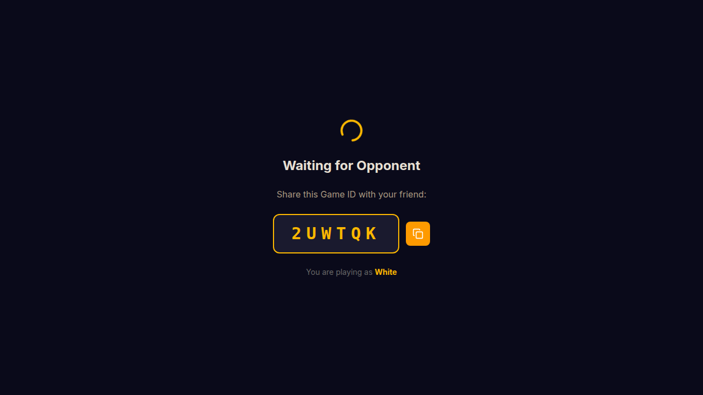

# mcoBG

Real-time multiplayer Backgammon in the browser. Two players connect through a
6-character Game ID, play a fully rule-validated game, and optionally video-chat
via WebRTC.

## Screenshots

| Landing page | Game board (dark theme) |
|---|---|
|  |  |

> **Note:** To generate these screenshots locally, start the dev servers, create
> a game in one tab, join from another, and capture the browser window. Place the
> images in `docs/`.

## Features

- **Create / Join** games with a shareable 6-character code
- **Full Backgammon rules** — movement, hitting, bar re-entry, bearing off,
  doubles, and forced-move detection are all enforced server-side
- **Click or drag** checkers to move — click-to-select then click-to-move, or
  drag a checker directly to its destination
- **Animated dice** with remaining-move tracking
- **Video / audio chat** between players via PeerJS (WebRTC)
- **Dark & light themes** (dark by default)
- **Board flip** — rotate the board 180 ° without affecting game logic
- **Modals** — About / How to Play, Config (theme, board direction, player
  info), Connect (Game ID + Peer ID with copy buttons)
- **Rematch** support after a game ends
- **Graceful disconnection** handling with opponent notification

## Architecture

```text
Browser A ◄──Socket.io──► API Server ◄──Socket.io──► Browser B
          ◄───WebRTC────────────────────────────────►
```

| Layer | Package | Tech |
|---|---|---|
| Frontend | `artifacts/mcobg` | React 19, Vite 7, Tailwind CSS 4, Socket.io client, PeerJS |
| Backend | `artifacts/api-server` | Express 5, Socket.io 4 |
| Shared lib | `lib/backgammon` | Pure TypeScript — game types, constants, and rules engine |

All game state lives **in-memory** on the server (no database). The shared
`@workspace/backgammon` library is imported by both the server and the client so
that types, movement-rule constants, and rule functions stay in sync.

## Repository Structure

```text
mcobg/
├── artifacts/
│   ├── api-server/            # Express + Socket.io backend
│   │   ├── src/
│   │   │   ├── index.ts           # HTTP server entry point
│   │   │   ├── app.ts             # Express app setup
│   │   │   ├── socket-handler.ts  # Socket.io event handlers & room mgmt
│   │   │   └── game-logic.ts      # Re-exports from @workspace/backgammon
│   │   └── package.json
│   └── mcobg/                 # React + Vite frontend
│       ├── src/
│       │   ├── App.tsx                # Root component, theme & flip state
│       │   ├── components/
│       │   │   ├── BackgammonBoard.tsx # SVG board with click + drag-and-drop
│       │   │   ├── GameScreen.tsx      # Game UI, controls, modals
│       │   │   ├── DiceTray.tsx        # Animated dice display
│       │   │   ├── VideoFeed.tsx       # PeerJS video chat
│       │   │   └── LandingPage.tsx     # Create / Join game screen
│       │   ├── hooks/
│       │   │   └── useGame.ts         # Game state hook (Socket.io client)
│       │   └── lib/
│       │       ├── socket.ts          # Socket.io client singleton
│       │       └── game-types.ts      # Re-exports from @workspace/backgammon
│       └── package.json
├── lib/
│   └── backgammon/            # Shared game library
│       └── src/
│           ├── types.ts           # BoardState, GameState, ValidMove, etc.
│           └── rules.ts           # Rules engine (init, validation, moves)
├── package.json               # Root — build & typecheck scripts
├── pnpm-workspace.yaml        # Workspace config + version catalog
└── tsconfig.base.json         # Shared TypeScript settings
```

> The repo also contains scaffolding packages (`lib/db`, `lib/api-spec`,
> `lib/api-zod`, `lib/api-client-react`, `scripts`) that are part of the
> monorepo template but are not actively used by mcoBG.

## How It Works

### Game Flow

1. **Player A** clicks *Create New Game* — the server creates a room, assigns
   **White**, and returns a 6-character Game ID.
2. **Player B** enters the Game ID and clicks *Join* — the server assigns
   **Black** and broadcasts `game-started` to both players.
3. Players take turns: **roll dice**, then **move checkers**. The server
   validates every move against the full Backgammon rules engine before applying
   it.
4. When all 15 checkers are borne off, the server emits `game-over`. Players can
   request a rematch.

### Board Encoding

The board is a 24-element integer array (`points[0..23]`).

| Value | Meaning |
|---|---|
| Positive | White checkers (e.g. `+5` = 5 white) |
| Negative | Black checkers (e.g. `-3` = 3 black) |
| `0` | Empty point |

Separate counters track `whiteBar`, `blackBar`, `whiteOff`, and `blackOff`.

### Movement Rules

| Player | Direction | Home board | Bar re-entry index | Bear-off target |
|---|---|---|---|---|
| White | 1 → 24 (ascending) | Points 19–24 | `-1` | `24` |
| Black | 24 → 1 (descending) | Points 1–6 | `24` | `-1` |

### Move Validation

The server uses `getValidMovesForFullTurn()` to compute all legal move sequences
for the current dice roll **before** letting the player choose. This prevents
players from making a partial move that would waste dice — the engine always
maximises the number of pips used, as the official rules require.

### Socket.io Events

| Event | Direction | Description |
|---|---|---|
| `create-game` | Client → Server | Create a new room; returns Game ID and White color |
| `join-game` | Client → Server | Join an existing room by Game ID; returns Black color |
| `game-started` | Server → Both | Both players are connected — game begins |
| `roll-dice` | Client → Server | Roll dice; server returns dice values + valid moves |
| `move-piece` | Client → Server | Submit a move (`from`, `to`); server validates and applies |
| `end-turn` | Client → Server | Manually end turn (when no moves remain) |
| `state-update` | Server → Both | Broadcast updated game state after any change |
| `game-over` | Server → Both | A player has borne off all 15 checkers |
| `share-peer-id` | Client → Server | Send PeerJS ID for video chat relay |
| `peer-id-shared` | Server → Opponent | Forward opponent's PeerJS ID |
| `request-rematch` | Client → Server | Ask for a rematch after game over |
| `rematch-requested` | Server → Opponent | Notify opponent of rematch request |
| `accept-rematch` | Client → Server | Accept rematch; server resets board |
| `rematch-accepted` | Server → Both | New game state after rematch |
| `opponent-disconnected` | Server → Remaining | Other player left; room is cleaned up |

## Getting Started

### Prerequisites

- **Node.js** >= 20
- **pnpm** >= 9

### Install Dependencies

```bash
pnpm install
```

### Run in Development

Start the backend and frontend together (each in its own terminal, or use a
process manager):

```bash
# Terminal 1 — API server (Express + Socket.io)
pnpm --filter @workspace/api-server run dev

# Terminal 2 — Frontend dev server (Vite)
pnpm --filter @workspace/mcobg run dev
```

The frontend dev server will print its local URL (e.g. `http://localhost:5173`).
Open it in two browser tabs or windows to simulate two players.

### Typecheck

```bash
pnpm run typecheck
```

This runs `tsc --build` across all workspace packages using TypeScript project
references.

### Production Build

```bash
pnpm run build
```

Runs typecheck first, then builds every package that has a `build` script
(Vite for the frontend, esbuild for the API server).

## Testing Locally

Since the game is multiplayer, testing requires two browser sessions:

1. Start the dev servers (see above).
2. Open the app in **Tab 1** and click *Create New Game*. Copy the Game ID.
3. Open the app in **Tab 2** and paste the Game ID, then click *Join*.
4. White moves first — roll dice, then click or drag a highlighted checker to a
   green destination point.

To test video chat, both tabs need camera/microphone permissions. Using two
different browsers (e.g. Chrome + Firefox) avoids permission conflicts on the
same device.

## Contributing

1. Fork the repo and create a feature branch.
2. Make your changes — the codebase is TypeScript throughout.
3. Run `pnpm run typecheck` to catch type errors.
4. Open a pull request with a clear description of what changed and why.

## License

MIT
